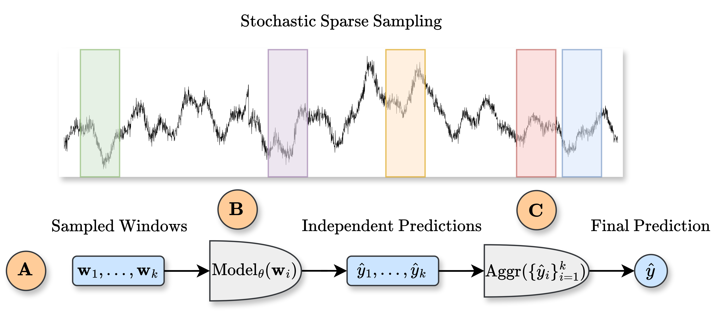
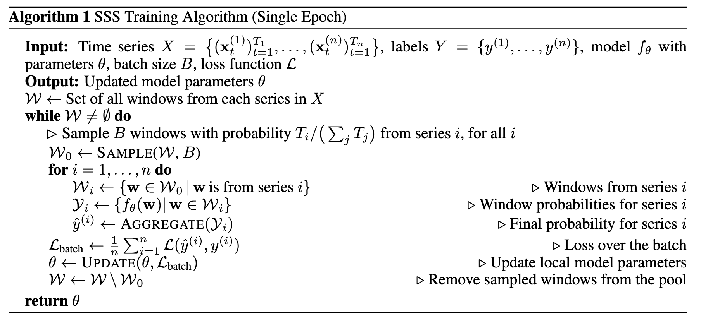
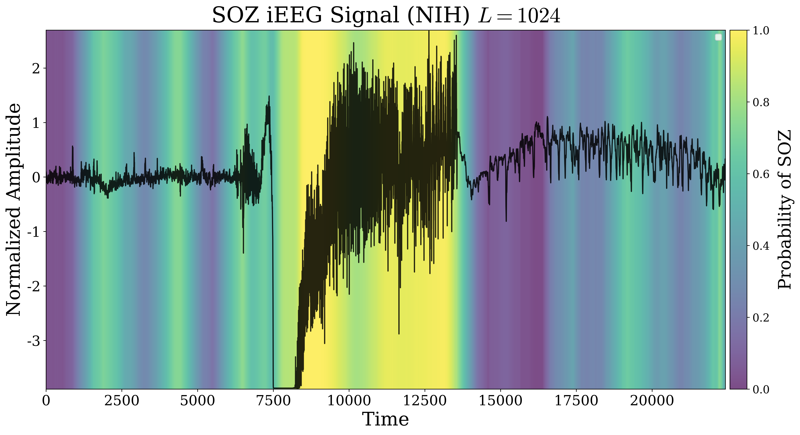
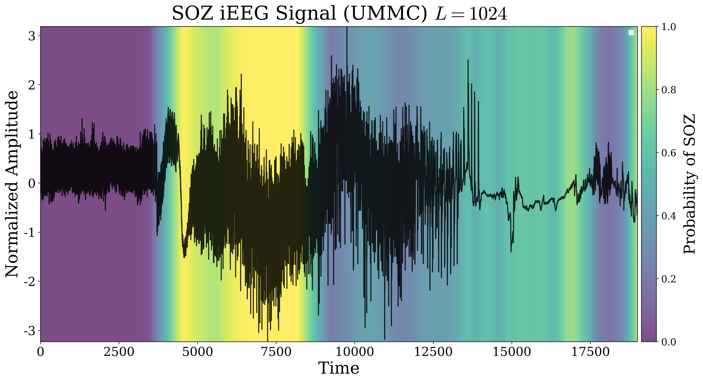
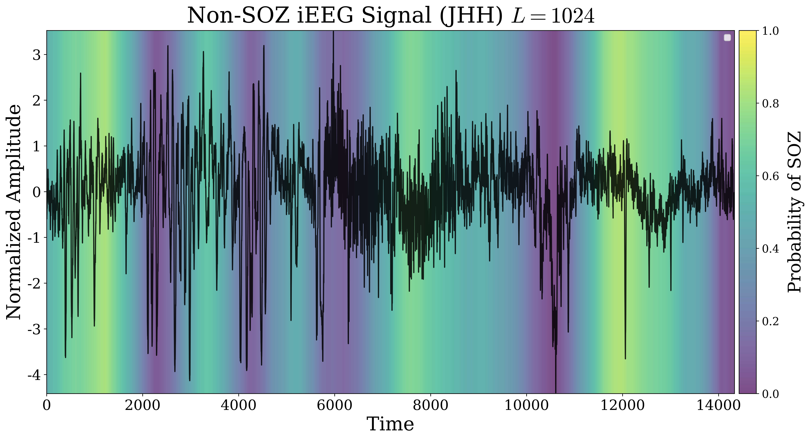
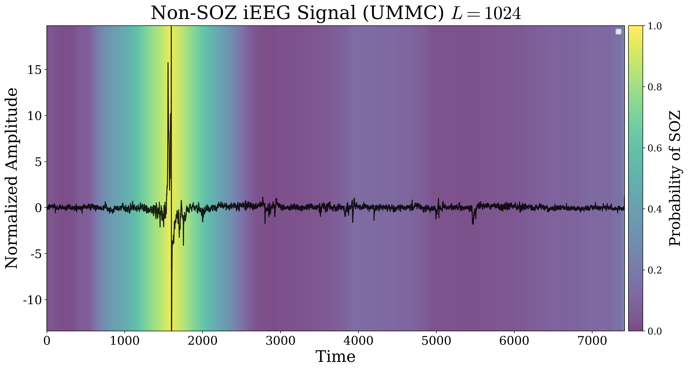

# Stochastic Sparse Sampling (SSS)
$\textbf{S}\text{tochastic } \textbf{S}\text{parse } \textbf{S}\text{ampling}$ (SSS) is a novel time series classification method for processing variable-length sequences. Notably, it outperforms many state-of-the-art machine learning and deep learning methods, benchmarked on the [Epilepsy iEEG Multicenter Dataset](#data) for seizure onset zone (SOZ) localization. Published in the **NeurIPS 2024 Workshop on Time Series in the Age of Large Models**.
* Full paper: [https://arxiv.org/abs/2410.06412](https://arxiv.org/abs/2410.06412)
* NeurIPS TSALM Workshop: [https://openreview.net/forum?id=4dpbdz280d](https://openreview.net/forum?id=4dpbdz280d)


<p align="center">
  <picture>
    <source media="(prefers-color-scheme: dark)" srcset="sss/assets/sss_architecture_dark.png">
    <source media="(prefers-color-scheme: light)" srcset="sss/assets/sss_architecture_light.png">
    
  </picture>
</p>


## Table of Contents
- [Description](#stochastic-sparse-sampling-sss)
- [Installation](#installation)
- [Project Structure](#project-structure)
- [Data](#data)
- [Usage](#usage)
- [Method](#method)
  - [Algorithm](#algorithm)
- [Visualization](#visualization)
  - [Prerequisites](#prerequisites)
  - [Setup](#setup)
  - [Running the Visualization](#running-the-visualization)
  - [Examples](#examples)
- [Dataset Description](#dataset-description)
- [License](#license)
- [Citations](#citations)
- [Contact](#contact)
- [Acknowledgments](#acknowledgments)

## Installation
### Dependencies
- Python $\geq$ 3.10
- Additional dependencies listed in `requirements.txt`

### Using conda (recommended)
```bash
# Create and activate conda environment
conda create -n sss python=3.10
conda activate sss

# Install requirements
pip install -r requirements.txt
pip install -e .
```

### Using pip
```bash
# Create and activate virtual environment
python -m venv venv
source venv/bin/activate  # On Windows: venv\Scripts\activate

# Install requirements
pip install -r requirements.txt
pip install -e .
```

## Project Structure
```
project_root/
│
├── sss/                    # Main package directory
│   ├── analysis/          # Visualization and analysis tools
│   │   └── soz/     # SOZ heatmap visualization
│   │
│   ├── config/           # Pydantic configuration classes
│   │
│   ├── exp/              # Experiment class
│   │
│   ├── jobs/             # Job configurations
│   │
│   ├── layers/           # Layers and model components
│   │
│   ├── models/          # Machine learning full models
│   │
│   ├── tuning/          # Hyperparameter optimization
│   │
│   └── utils/           # Helper functions, preprocessing, logging
│
├── data/                # Dataset files
├── download_data.sh     # Data download script
├── main.py             # Main execution script
├── setup.py            # Package installation script
├── requirements.txt    # Python dependencies
└── README.md          # Documentation
```


## Data
To download the required datasets, run:
```bash
chmod u+x download_data.sh
./download_data.sh
```

## Usage

### Running Experiments
Execute the main script with the desired model:
```python
python main.py <model>
```

Available models:
- `sss`: Stochastic Sparse Sampling
- **Finite Context Models:**
  - `finite-context/dlinear`: DLinear
  - `finite-context/patchtst`: PatchTST
  - `finite-context/timesnet`: TimesNet
  - `finite-context/moderntcn`: ModernTCN
- **Infinite Context Models:**
  - `infinite-context/mamba`: Mamba
  - `infinite-context/gru`: GRUs
  - `infinite-context/lstm`: LSTMs
  - `infinite-context/rocket`: ROCKET

Results are saved in the `logs` folder. For Distributed Data Parallel (DDP) or other configurations, modify `sss/jobs/exp/<model>/args.yaml`.

## Method
While the majority of time series classification research has focused on modeling fixed-length sequences, variable-length time series classification (VTSC) remains critical in healthcare, where sequence length may vary among patients and events. To address this challenge, we propose $\textbf{S}\text{tochastic } \textbf{S}\text{parse } \textbf{S}\text{ampling}$, a novel VTSC framework developed for medical time series. SSS manages variable-length sequences by sparsely sampling fixed windows to compute local predictions, which are then aggregated and calibrated to form a global prediction. We apply SSS to the task of seizure onset zone (SOZ) localization, a critical VTSC problem requiring identification of seizure-inducing brain regions from variable-length electrophysiological time series. We evaluate our method on the Epilepsy iEEG Multicenter Dataset, a heterogeneous collection of intracranial electroencephalography (iEEG) recordings obtained from four independent medical centers. SSS demonstrates superior performance compared to state-of-the-art (SOTA) baselines across most medical centers, and superior performance on all out-of-distribution (OOD) unseen medical centers. Additionally, SSS naturally provides post-hoc insights into local signal characteristics related to the SOZ, by visualizing temporally averaged local predictions throughout the signal.

### Algorithm
The SSS training algorithm is outlined below:

<p align="center">
  
</p>


## Visualization

The project includes a visualization tool (`sss/analysis/soz/visualize.py`) for generating SOZ (Seizure Onset Zone) heatmap analysis of trained models. This tool integrates with Neptune.ai for model management and visualization.

### Prerequisites
1. Neptune.ai account and API token
2. Trained model saved to Neptune (via `main.py`)
3. Neptune run ID for the model you want to analyze

### Setup
1. Set your Neptune API token as an environment variable:
```bash
export NEPTUNE_API_TOKEN='your-neptune-api-token'
```

2. Modify the `sss/analysis/soz/plot.yaml` configuration file. Example:
```yaml
run_id: "SOZ-33"              # Your Neptune run ID
project_name: "your-project"  # Your Neptune project name
mode: "train"                # Analysis mode
...
```
For a complete list of configuration options and their descriptions, refer to the `Config` class in `visualize.py`.

### Running the Visualization
```bash
cd sss/analysis/soz
python visualize.py
```

This will load the model from Neptune and generate SOZ heatmap that will be saved.

### Examples
<p align="center">
  
</p>

<p align="center">
  
</p>

<p align="center">
  
</p>

<p align="center">
  
</p>


## Dataset Description
The [Epilepsy iEEG Multicenter Dataset](https://openneuro.org/datasets/ds003029/versions/1.0.7) consists of iEEG signals with SOZ clinical annotations from four medical centers including the Johns Hopkins Hospital (JHH), the National Institute of Health (NIH), University of Maryland Medical Center (UMMC), and University of Miami Jackson Memorial Hospital (UMH). Since UMH contained only a single patient with clinical SOZ annotations, we did not consider it in our main evaluations; however, we did use UMH within the multicenter evaluation in training set for both the all cluster evaluation,  and out-of-distribution (OOD) experiments for SOZ localization on unseen medical centers.

## License

This project is licensed under the MIT License - see the [LICENSE](LICENSE) file for details.

## Citations
If you use this code in your research, please cite our paper:
```bibtex
@article{mootoo2024stochastic,
    title     = {Stochastic Sparse Sampling: A Framework for Variable-Length Medical Time Series Classification},
    author    = {Mootoo, Xavier and D\'{i}az-Montiel, Alan A. and Lankarany, Milad and Tabassum, Hina},
    journal   = {arXiv preprint arXiv:2410.06412},
    year      = {2024},
    url       = {https://arxiv.org/abs/2410.06412},
    eprint    = {2410.06412},
    archivePrefix = {arXiv},
    primaryClass = {cs.LG}
}
```
The full paper is available on [arXiv](https://arxiv.org/abs/2410.06412).

## Contact
For queries, please contact the corresponding author through: `xmootoo at gmail dot com`.

## Acknowledgments
Xavier Mootoo is supported by Canada Graduate Scholarships - Master's (CGS-M) funded by the [Natural Sciences and Engineering Research Council](https://www.nserc-crsng.gc.ca/index_eng.asp) (NSERC) of Canada, the Vector Scholarship in Artificial Intelligence, provided through the [Vector Institute](https://vectorinstitute.ai/), Canada, and the Ontario Graduate Scholarship (OGS) granted by the provincial government of Ontario, Canada. 

We extend our gratitude to [Commune AI](https://communeai.org/) for generously providing the computational resources needed to carry out our experiments, in particular, we thank Luca Vivona ([@LVivona](https://github.com/LVivona)) and Sal Vivona ([@salvivona](https://github.com/salvivona)). We also greatly thank Anastasios Angelopoulos ([@aangelopoulos](https://github.com/aangelopoulos)) and Daniele Grattarola ([@danielegrattarola](https://github.com/danielegrattarola)) for their valuable feedback and comments on our work.